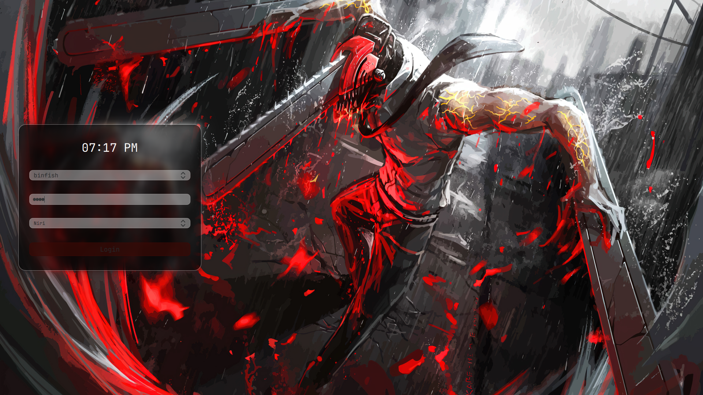

# pixelDM
my own SDDM THEME 
its not based on something its not forked all written on my own!

# SCREENS


# Install

**dependencis**
qt5-tools qt5-quickcontrols2 qt5-quickcontrols qt5-svg
>the dependencis are for void linux!

**copy configs**

```
git clone https://github.com/binarylinuxx/pixeldm
cp -r ~/pixeldm /usr/share/sddm/themes/
```

then create /etc/sddm.conf

make it look:
```
[Theme]
Current=pixeldm
```
